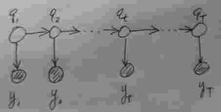
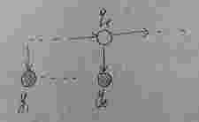
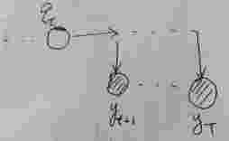

## 隐马尔科夫模型

[TOC]

隐马尔科夫模型(hidden Markov model, HMM)是可用于标注问题的统计学习模型，描述由**隐藏的马尔科夫随机链随机生成的观测序列**，属于生成模型。隐马尔科夫模型在语音识别、自然语音处理、模式识别上有广泛的应用。

一个简单的例子就是输入法，你在键盘上打一串字符，输入法猜测你想写的词或者一段话，按照可能性给你列出来，你打的字符串就是观测变量，你想表达的意思就是隐变量，这就是一个隐马尔科夫模型。

这里要说明的3点：

+ 隐马尔科夫模型的隐变量式必须式离散的，如果隐变量式连续的，又分为线性和非线性，线性的式kalman filter，非线性的就是particle filter；

+ 对观测变量没有要求，即观测变量可以是离散的，也可以是连续的，比如观测变量GMM分布（高斯混合模型），这里我们先考虑观测变量式离散的；
+ 我们讨论的序列数据式静态的(stationary)，也就是生成的数据会随着时间改变，但是生成数据的概率保持不变，隐马尔科夫模型就是这样的，其中的转移概率矩阵和发射矩阵不随时间改变，这样才可以通过EM算法求得参数；但有些序列数据是动态的（nonstationary），即生成数据的概率分布会随着时间而改变，这里要有这种对数据过程的意识。

### 隐马尔科夫模型定义

隐马尔科夫模型是关于时序的模型，它由一个隐马尔科夫链先生成隐藏变量，然后由隐藏变量生成观测变量，其图模型是下面的样子：

上图中的$q​$是状态序列，$y​$表示观测序列。假设离散状态序列的取值范围是$q=\left\{1,2,...,N \right\}​$，离散观测序列的取值范围是$y=\left\{o_1,o_2,...,o_M \right\}​$，这里我们不用$y=\left\{1,2,...,M \right\}​$来表示是为了当$y​$是连续变量时好转换，这在后面就可以看到。我们可以通过联合分布来看看还需要哪些量需要计算，这个通过图模型就可以看出来：
$$
p(q_1,...,q_T,y_1,...,y_T)=p(q_1)\prod_{t=2}^T p(q_t|q_{t-1}) \prod_{t=1}^T p(y_t|q_t)\tag{1.1}
$$
通过图模型，应用D-Separation定理，可以很容易得出HMM的齐次性和观测独立性。

HMM齐次性：
$$
p(q_{t}|q_{t-1},...,q_1)=p(q_t|q_{t-1})\tag{1.2}
$$
也就是当前状态的仅依赖上一个状态，与之前的其他状态无关。

观测独立性：
$$
p(y_t|q_t,q_{t-1},...,q_1,y_{t-1},...,y_1)=p(y_t|q_{t})\tag{1.3}
$$
也就是说，当前的观测变量只与当前的隐变量有关，与之前的观测变量无关。

***//这两个性质表达的直观意思就是：隐马尔科夫模型不具备记忆的特性***

通过$(1.1)​$式，我们还需要定义$p(q_1)、p(q_t|q_{t-1})、p(y_t|q_t)​$：
$$
p(q_1=i)=\pi_i\\
p(q_t=j|q_{t-1}=i)=a_{ij}\,\,\,\,\,\,\,\,\,\,\,\,\,\,\,\,\,\,\,\,\,\,\,\,\,\,\,\,\,\,\,\,\,\Rightarrow A=[a_{ij}]_{N\times N}     \\   
p(y_t=o_j|q_t=i)=b_i(y_t=j)\,\,\,\,\,\,\,\,\,\,\,\,\,\,\,\,\,\,\Rightarrow B=[b_{i}(y_t=j)]_{N\times M} \tag{1.4}
$$

这样，如果我们知道了参数$\lambda=(\pi,A,B)​$，那么整个HMM模型也就确定了。

### 隐马尔科夫模型三个问题

隐马尔科夫模型很自然的有三个问题：

+ 估计问题：$p(y_1,...,y_T|\lambda)​$，即给定模型参数$\lambda=(\pi,A,B)​$和观测序列$Y=(y_1,...,y_T)​$，计算概率$p(y_1,...,y_T|\lambda)​$；
+ 学习问题：已知观测序列，估计模型参数$\lambda=(\pi,A,B)​$；
+ 预测问题：也称为解码问题，给定模型参数$\lambda=(\pi,A,B)$和观测序列$Y=(y_1,...,y_T)$，求对应的状态序列最大的概率$p(Q|Y,\lambda)$，所谓的解码就是因为$Q$是隐变量，就像基因编码决定了表达（可观测的外貌），把基因给求出来，相当于解码。

### 隐马尔科夫模型问题求解

#### 估计问题

估计问题需要知道模型参数$\lambda=(\pi,A,B)$，其实也就是先要通过学习问题求出模型参数，再进行估计问题，但是我们先谈估计问题，是因为估计问题的方法：向前法和向后法，在学习问题中可以用得到，这在后面可以看到。

在谈向前算法和向后算法之前，我们来看看直接求该怎么做。
$$
\begin{align}
p(y_1,...,y_T|\lambda)
&=\sum_Q p(q_1,...,q_T,y_1,...,y_T|\lambda)\\
&=\sum_Q p(q_1)\prod_{t=2}^T p(q_t|q_{t-1}) \prod_{t=1}^T p(y_t|q_t)\\
&=\sum_{q_1=1}^N...\sum_{q_T=1}^N \pi_{q_1}\prod_{t=2}^Ta_{q_{t-1},q_t}\prod_{t=1}^T b_{q_t}(y_t)  \tag{2.1}
\end{align}
$$
这里面一个标记的好方法就是将变量$q_t$转化为下标，值得学习。我们来看一下计算复杂度，$T$个求和，每个求和有$N$种情况，按照排列来看，就是$N^T$，随着时间长度式指数增长的，显然这种算法不可行。

1. 向前算法（forward method）：

令$\alpha_t(i)=p(q_t=i,y_1,...,y_t)​$，这里为了下面推导的方便，省略了对$\lambda​$的依赖：
$$
\begin{align}
\alpha_t(i)
&=p(q_t=i,y_1,...,y_t)\\
&=\sum_{j=1}^N p(q_{t-1}=j,q_t=i,y_1,...,y_t)\\
&=\sum_{j=1}^N p(q_t=i,y_t|q_{t-1}=j,y_1,...,y_{t-1})p(q_{t-1}=j,y_1,...,y_{t-1})\\
&=\sum_{j=1}^N p(y_t|q_{t-1}=j,q_t=i,y_1,...,y_{t-1})p(q_t=i|q_{t-1}=j,y_1,...,y_{t-1},y_t)\alpha_{t-1}(j)\\
&=\sum_{j=1}^N p(y_t|q_t=i)p(q_t=i|q_{t-1}=j)\alpha_{t-1}(j)\\
&=\sum_{j=1}^N b_i(y_t)a_{ji}\alpha_{t-1}(j)\\
&=b_i(y_t)\sum_{j=1}^N a_{ji}\alpha_{t-1}(j)\\
\end{align}   \tag{2.2}
$$
这里为了推导$\alpha_t(i)=p(q_t=i,y_1,...,y_t)$和$\alpha_{t-1}(j)=p(q_t=j,y_1,...,y_{t-1})$的关系，我们在第二步中强行加入了$q_{t-1}$，然后在第3步中直接把$\alpha_{t-1}(j)=p(q_t=j,y_1,...,y_{t-1})$给凑出来，这种方法应该学习。

那么
$$
p(y_1,...,y_T)=\sum_{i=1}^N p(q_T=i,y_1,...,y_T)=\sum_{i=1}^N \alpha_T(i)  \tag{2.3}
$$
我们通过$\alpha_1$可计算$\alpha_2$，以此类推可计算出$\alpha_T$，这样就解决问题了。这里说一下计算复杂度，每个时间上的$\alpha_t(i)$有$N$中情况，所以复杂度是$T\times N$，相比较与直接求，显然这种线性复杂度计算量大大减少，计算上是可行的。

2. 向后算法

   

   令$\beta_t(i)=p(y_{t+1},...,y_T|q_t=i)​$，同样省去了对$\lambda​$的依赖：
   $$
   \begin{align}
   \beta_t(i)=p(y_{t+1},...,y_T|q_t=i)
   &=\sum_{j=1}^N p(y_{t+1},...,y_T,q_{t+1}=j|q_t=i)  \\
   &=\sum_{j=1}^N p(q_{t+1}=j|q_t=i)p(y_{t+1},...,y_T|q_{t+1}=j,q_t=i)  \\
   &=\sum_{j=1}^N a_{ij}p(y_{t+1},...,y_T|q_{t+1}=j)   \\
   &=\sum_{j=1}^N a_{ij}p(y_{t+1}|q_{t+1}=j)p(y_{t+2},...,y_T|q_{t+1}=j,y_{t+1})   \\
   &=\sum_{j=1}^N a_{ij}b_j(y_{t+1})p(y_{t+2},...,y_T|q_{t+1}=j)   \\ 
   &=\sum_{j=1}^N a_{ij}b_j(y_{t+1})\beta_{t+1}(j)   \\ 
   \end{align}   \tag{2.4}
   $$
   那么
   $$
   \begin{align}
   p(y_1,...,y_T)
   &=\sum_{i=1}^N p(y_1,...,y_T|q_1=i)p(q_1=i)\\
   &=\sum_{i=1}^N p(y_1|q_1=i)p(y_2,...,y_T|q_1=i,y_1)p(q_1=i)\\
   &=\sum_{i=1}^N p(y_1|q_1=i)p(y_2,...,y_T|q_1=i)p(q_1=i)\\
   &=\sum_{i=1}^N b_i({y_1})\pi_i\beta_1(i) 
   \end{align}
   \tag{2.5}
   $$
   通过计算$\beta_{T-1}(i)​$，就可以计算出$\beta_{T-2}(i)​$，依次可以计算出$\beta_{1}(i)​$。

   注意：$\beta_{T-1}(i)=p(y_T|q_{T-1}=i)=\sum_{j=1}^N a_{ij}b_j(y_{T})$，对照$(2.4)$式，可以看出，我们可以让$\beta_{T}(i)=1,\,\,\, i=1,2,...,N$，这样递推式就完整了。

   向前算法和向后算法计算结果式相同的，计算复杂度也是相同的，那有了向前算法，何必要在谈向后算法呢？这是因为我们在学习问题的时候会用到。

   我们把会用到的概率求解现在写下来。

   1. 求$p(q_t=i|y_1,...,y_T,\lambda)$：
      $$
      \begin{align}
      \gamma_t(i)
      &=p(q_t=i|y_1,...,y_T)\\
      &=\frac{p(q_t=i,y_1,...,y_T)}{\sum_{j=1}^N (q_t=j,y_1,...,y_T)}\\
      &=\frac{p(q_t=i,y_1,...,y_t)p(y_{t+1},...,y_{T}|q_t=i,y_1,...,y_t)}{\sum_{j=1}^N p(q_t=j,y_1,...,y_T)}\\
      &=\frac{p(q_t=i,y_1,...,y_t)p(y_{t+1},...,y_{T}|q_t=i)}{\sum_{j=1}^N p(q_t=j,y_1,...,y_T)}\\
      &=\frac{\alpha_t(i)\beta_t(i)}{\sum_{j=1}^N \alpha_t(j)\beta_t(j)}\\
      \end{align}  \tag{2.6}
      $$
      

      2.求$p(q_t=i,q_{t+1}=j|y_1,...,y_T,\lambda)​$：
      $$
      \begin{align}
      \xi_t(i,j)
      &=p(q_t=i,q_{t+1}=j|y_1,...,y_T)\\
      &=\frac{p(q_t=i,q_{t+1}=j,y_1,...,y_T)}{\sum_{i=1}^N\sum_{j=1}^N p(q_t=i,q_{t+1}=j,y_1,...,y_T)}\\
      &=\frac{p(q_t=i,y_1,...,y_t)p(q_{t+1}=j,y_{t+1},...,y_T|q_t=i)}{\sum_{i=1}^N\sum_{j=1}^N p(q_t=i,q_{t+1}=j,y_1,...,y_T)}\\
      &=\frac{\alpha_t{(i)}p(q_{t+1}=j|q_t=i)p(y_{t+1},...,y_T|q_{t+1}=j,q_t=i)}{\sum_{i=1}^N\sum_{j=1}^N p(q_t=i,q_{t+1}=j,y_1,...,y_T)}\\
      &=\frac{\alpha_t{(i)}a_{ij}p(y_{t+1}|q_{t+1}=j,q_t=i)p(y_{t+2},...,y_T|q_{t+1}=j,q_t=i,y_{t+1})}{\sum_{i=1}^N\sum_{j=1}^N p(q_t=i,q_{t+1}=j,y_1,...,y_T)}\\
      &=\frac{\alpha_t{(i)}a_{ij}b_{t+1}(j)p(y_{t+2},...,y_T|q_{t+1}=j)}{\sum_{i=1}^N\sum_{j=1}^N p(q_t=i,q_{t+1}=j,y_1,...,y_T)}\\
      &=\frac{\alpha_t{(i)}a_{ij}b_{t+1}(j)\beta_{t+1}(j)}{\sum_{i=1}^N\sum_{j=1}^N p(\alpha_t{(i)}a_{ij}b_{t+1}(j)\beta_{t+1}(j)}
      \end{align}  \tag{2.7}
      $$
      上面多次用到了HMM独立性质。

      

   

#### 学习问题

已知观测序列，估计模型参数$\lambda=(\pi,A,B)$。我们知道，由于隐函数的存在，所以直接对不完整的似然函数求导来求，将极为复杂，得不到闭式解，对于由隐变量的问题，有EM算法这一利器，虽然使用EM算法，由于当时EM算法这个名称还有没提出来，所以这里的名字叫$Baum-Welch$算法。

现在叙述如下，假设已给训练数据包括$D​$个长度相同的观测序列$Y=\left\{Y_1, ...,Y_D \right\}​$，对应的隐藏变量为也是$D​$个序列$Q=\left\{Q_1, ...,Q_D \right\}​$，要注意的是，之前的推导都是对一个序列而言的，而实际收集数据中，对于同一个东西，会收集很多份，比如语音识别，坑能会收集上百份发音为$“cat”​$的语音。

通过EM算法可以较为简单的求出结果，E步：
$$
\mathcal L(\lambda,\lambda^{old})=\sum_Q p(Q|\lambda^{old})\ln p(Y,Q|\lambda)  \tag{3.1}
$$

计算联合分布$p(Y,Q|\lambda)$，我们假设每个序列式独立的：
$$
p(Y,Q|\lambda)=\prod_{d=1}^D \left\{\pi_{q_1^d}\prod_{t=2}^Ta_{q_{t-1}^d,q^d_t}\prod_{t=1}^T b_{q_t^d}(y^d_t)\right\}  \tag{3.2}
$$
{**对于$p(Q|\lambda^{old})​$，我们发现很难将它的表达式求出来，但是$p(Y,Q|\lambda)​$已经表示出}，这句话理解的不对**，其实依旧使用$p(Q|\lambda^{old})​$，在这里也没有什么问题，

这是因为对于$\sum_i^N p(q_t=i)=1$，始终有$\sum_i^N p(q_t=i|Y)=1$，那么始终有$\sum_{q_1=1}^N...\sum_{q_T=1}^N  p(Q|Y,\lambda^{old}) \ln\pi_{q_1}=\sum_{q_1=1}^N  p(q_1=i|Y,\lambda^{old}) \ln\pi_{q_1}\\$，所以没有看出来简化在哪里，prml中就没有替换$p(Y,Q|\lambda)$，李航的《统计学习方法》中使用了替换，徐亦达的课程中也使用了替换，不过替不替换，推导难度式相同的。

在M步中是求$\max \mathcal L(\lambda,\lambda^{old})$，我们来看看能否用等价的东西来求最大值：
$$
\lambda^{new}=\arg\max_{\lambda} \sum_Q p(Q|\lambda^{old})\ln p(Y,Q|\lambda)=\arg\max_{\lambda} \sum_Q \frac{p(Q,Y|\lambda^{old})}{p(Y)}\ln p(Y,Q|\lambda)=\arg\max_{\lambda} \sum_Q p(Q,Y|\lambda^{old})\ln p(Y,Q|\lambda)  \tag{3.3}
$$

  上式中分母$p(Y)​$与参数$\lambda​$ 和求和对象$Q​$无关，所以相当与是个常数，所以E步可以等价的化为：

$$
\mathcal L(\lambda,\lambda^{old})=\sum_Q p(Q,Y|\lambda^{old})\ln p(Y,Q|\lambda)  \tag{3.4}
$$

​	我们具体展开：
$$
\begin{align}
\mathcal L(\lambda,\lambda^{old})
&=\sum_Q p(Q,Y|\lambda^{old})\ln p(Y,Q|\lambda) \\
&=\sum_Q p(Q,Y|\lambda^{old}) \sum_{d=1}^D \left\{\ln\pi_{q_1^d}+\sum_{t=2}^T\ln a_{q_{t-1}^d,q^d_t}+\sum_{t=1}^T\ln b_{q_t^d}(y^d_t)\right\}\\
&=\sum_{d=1}^D \sum_Q p(Q,Y|\lambda^{old}) \left\{\ln\pi_{q_1^d}+\sum_{t=2}^T\ln a_{q_{t-1}^d,q^d_t}+\sum_{t=1}^T\ln b_{q_t^d}(y^d_t)\right\}
\end{align} \tag{3.4}
$$
​	我们这里可以分部分进行计算，因为我们在估计$\pi$的时候，只是大括号中的第一项与之有关：
$$
\begin{align}
term_1
&=\sum_{d=1}^D \left\{\sum_{q_1^1=1}^N...\sum_{q_T^1=1}^N...\sum_{q_1^D=1}^N...\sum_{q_T^D=1}^N p(Q,Y|\lambda^{old}) \ln\pi_{q_1^d}\right\}\\
&=\sum_{d=1}^D \left\{\sum_{q_1^d=1}^N p(q_1^d,Y|\lambda^{old}) \ln\pi_{q_1^d}\right\}\\ 
&=\sum_{d=1}^D \sum_{i=1}^N p(q_1^d=i,Y|\lambda^{old}) \ln\pi_i\\ 
\end{align}   \tag{3.5}
$$
​	这里从第一步到第二部大括号里面求和的部分，只要是和$\ln \pi_{q_1^d}$无关的，都可以用概率求和的形式，将变量消去，故得第二步，第三步是将变量表示的下标，更	改为普通下标，这样好求问题。

​	直接对$(3.5)$求导是不对的，因为还有约束条件$\sum_{i=1}^N \pi_i=1$，可以用拉格朗日乘子法，步骤为：
$$
\arg\;\max_{\pi_{i}}\sum_{d=1}^D\sum_{i=1}^Np(q_1^d=i,Y|\lambda^{old}) \ln\pi_i + \gamma(\sum\limits_{i=1}^N\pi_i -1)  \tag{3.6}
$$
​	对上式求导：
$$
\sum\limits_{d=1}^Dp(q_1^d=i,Y|\lambda^{old}) + \gamma\pi_i = 0  \tag{3.7}
$$
​	从而：
$$
\sum_{i=1}^N\sum\limits_{d=1}^Dp(q_1^d=i,Y|\lambda^{old}) + \gamma\sum_{i=1}^N\pi_i = 0\\
\Rightarrow \,\,\sum\limits_{d=1}^Dp(Y|\lambda^{old}) + \gamma= 0\\  \tag{3.8}
$$
​	将$(3.8)$带入到$(3.7)$可得：
$$
\pi_i=\frac{\sum_{d=1}^Dp(q_1^d=i,Y|\lambda^{old})}{\sum_{d=1}^Dp(Y|\lambda^{old})}= \frac{\sum_{d=1}^Dp(q_1^d=i,Y|\lambda^{old})}{Dp(Y|\lambda^{old})}=\frac{\sum_{d=1}^Dp(q_1^d=i|Y,\lambda^{old})}{D}=\frac{\sum_{d=1}^Dp(q_1^d=i|Y^d,\lambda^{old})}{D}   \tag{3.9}
$$
​	这里面最后一步是$p(q_1^d=i|Y^d,\lambda^{old})=p(q_1^d=i|Y^1,...,Y^d,...,y^D,\lambda^{old})=p(q_1^d=i|Y^d,\lambda^{old})$，这是因为条件独立。

​	对于$(3.7)$式，这里就可以看出向前算法和向后算法推导出的$(2.6)$的用处了：
$$
\pi_i=\frac{\sum_{d=1}^Dp(q_1^d=i|Y^d,\lambda^{old})}{D}=\frac{\sum_{d=1}^D\gamma_1^d(i)}{D}  \tag{3.10}
$$
​	这里我们要说明一下，上面对$D$个训练集进行求解，我们感觉推导过程比较繁琐，有没有简单的一些方法呢？有的，就是对单个训练集进行推导，也就是$D=1	$	，此时结果就应该是：
$$
\pi_i=\frac{p(q_1=i,Y|\lambda^{old})}{p(Y|\lambda^{old})}=p(q_1=i|Y,\lambda^{old})=\gamma_1(i)  \tag{3.11}
$$
​	对于只有一个训练集，EM算法的E步就是求
$$
\begin{align}
\mathcal L(\lambda,\lambda^{old})
&=\sum_{q_1=1}^N...\sum_{q_T=1}^N p(Q,Y|\lambda^{old})\ln p(Y,Q|\lambda) \\
&=\sum_{q_1=1}^N...\sum_{q_T=1}^N  p(Q,Y|\lambda^{old}) \left\{\ln\pi_{q_1}+\sum_{t=2}^T\ln a_{q_{t-1},q_t}+\sum_{t=1}^T\ln b_{q_t}(y_t)\right\}\\
\end{align} \tag{3.12}
$$
​	对于$term_1$：
$$
\begin{align}
term_1
&=\sum_{q_1=1}^N...\sum_{q_T=1}^N  p(Q,Y|\lambda^{old}) \ln\pi_{q_1}=\sum_{q_1=1}^N p(q_1,Y|\lambda^{old}) \ln\pi_{q_1}=\sum_{i=1}^N p(q_1=i,Y|\lambda^{old}) \ln\pi_{i}
\end{align}   \tag{3.13}
$$
​	结合约束$\sum_{i=1}^N \pi_i=1$，利用拉格朗日乘子法：
$$
\arg\;\max_{\pi_{i}}\sum_{i=1}^N p(q_1=i,Y|\lambda^{old}) \ln\pi_{i}+ \gamma(\sum\limits_{i=1}^N\pi_i -1)  \tag{3.14}
$$
​	可以求得：
$$
\pi_i=\frac{p(q_1=i,Y|\lambda^{old})}{p(Y|\lambda^{old})}=\gamma_1(i) \tag{3.15}
$$
​	可见这样求要简单的多，要扩展到多个序列，$D=D$的情况，很容易，就是将分子分母都进行$\sum_{d=1}^D$求和就行了，也就是$(3.9)$式。

​	接下来我们求$a_{ij}、b_j(y)$也按照先在一个序列上求，再扩展到$D$的情况。

​	对于$term_2$：
$$
\begin{align}
term_2
&=\sum_{q_1=1}^N...\sum_{q_T=1}^N  p(Q,Y|\lambda^{old}) \sum_{t=2}^T\ln a_{q_{t-1},q_t}\\
&=\sum_{t=2}^T\sum_{q_{t-1}=1}^N\sum_{q_t=1}^N  p(q_{t-1},q_t,Y|\lambda^{old}) \ln a_{q_{t-1},q_t}\\
&=\sum_{t=2}^T\sum_{i=1}^N\sum_{j=1}^N  p(q_{t-1}=i,q_t=j,Y|\lambda^{old}) \ln a_{ij}\\
\end{align}\tag{4.1}
$$
​	这里还有个约束条件就是：
$$
\sum_{j=1}^N a_{ij}=1 \tag{4.2}
$$
​	那么Lagrange 乘子法就是：
$$
L=\sum_{t=2}^T\sum_{i=1}^N\sum_{j=1}^N  p(q_{t-1}=i,q_t=j,Y|\lambda^{old}) \ln a_{ij}+\sum_{i=1}^N \tau_i(\sum_{j=1}^N a_{ij}-1)
$$
​	通过分别对$a_{ij}、\tau_i$求导可得：
$$
\frac{\partial L}{\partial a_{ij}}=\frac{\sum_{t=2}^T p(q_{t-1}=i,q_t=j,Y|\lambda^{old})}{a_{ij}}+\tau_i=0\\
\Rightarrow \,\, \frac{\partial L}{\partial \tau_{i}}=\sum_{j=1}^N a_{ij}-1=0   \\
\tag{4.3}
$$
​	从上式可得：
$$
\sum_{j=1}^N a_{ij}=1\\
\sum_{t=2}^T p(q_{t-1}=i,q_t=j,Y|\lambda^{old})+\tau_i{a_{ij}}=0\\
\Rightarrow \sum_{j=1}^N\sum_{t=2}^T p(q_{t-1}=i,q_t=j,Y|\lambda^{old})+\tau_i\sum_{j=1}^N{a_{ij}}=0\\
\Rightarrow \sum_{t=2}^T p(q_{t-1}=i,Y|\lambda^{old})+\tau_i=0\\
\Rightarrow \tau_i=-\sum_{t=2}^T p(q_{t-1}=i,Y|\lambda^{old})\\
\Rightarrow a_{ij}=\frac{\sum_{t=2}^T p(q_{t-1}=i,q_t=j,Y|\lambda^{old})}{\sum_{t=2}^T p(q_{t-1}=i,Y|\lambda^{old})}\\ \tag{4.4}
$$
​	我们改变一下上式的下标，结果为：
$$
a_{ij}=\frac{\sum_{t=1}^{T-1} p(q_{t}=i,q_{t+1}=j,Y|\lambda^{old})}{\sum_{t=1}^{T-1} p(q_{t}=i,Y|\lambda^{old})}=\frac{\frac{\sum_{t=1}^{T-1} p(q_{t}=i,q_{t+1}=j,Y|\lambda^{old})}{p(Y|\lambda^{old})}}{\frac{\sum_{t=1}^{T-1} p(q_{t}=i,Y|\lambda^{old})}{p(Y|\lambda^{old})}}=\frac{\sum_{t=1}^{T-1} p(q_{t}=i,q_{t+1}=j|Y,\lambda^{old})}{\sum_{t=1}^{T-1} p(q_{t}=i|Y,\lambda^{old})}=\frac{\sum_{t=1}^{T-1}\xi_t(i,j)}{\sum_{t=1}^{T-1}\gamma_t(i)} \tag{4.5}
$$
​	上式分子和分母正好对应了$(2.7)$和$(2.6)$式，这也是应用了向前算法和向后算法得到的结果。

​	现在拓展到训练序列有$D$个的情况，只需要对分子分母求$\sum_{d=1}^D$即可：
$$
a_{ij}=\frac{\sum_{d=1}^D \sum_{t=1}^{T-1}\xi_t^d(i,j)}{\sum_{d=1}^D\sum_{t=1}^{T-1}\gamma_t^d(i)} \tag{4.6}
$$
​	对于求$b_i(y_t=o_j)$和求$a_{ij}$类似：
$$
\begin{align}
term_3
&=\sum_{q_1=1}^N...\sum_{q_T=1}^N  p(Q,Y|\lambda^{old}) \sum_{t=1}^T\ln b_{q_t}(y_t)\\
&=\sum_{t=1}^T\sum_{q_t=1}^N  p(q_t,Y|\lambda^{old}) \ln b_{q_t}(y_t)\\
&=\sum_{t=1}^T\sum_{i=1}^N  p(q_t=i,Y|\lambda^{old}) \ln b_{i}(y_t)\\
\end{align}\tag{5.1}
$$
​	同样有个约束：$\sum_{m=1}^M b_i(m)=1$，利用Lagrange 法：
$$
L=\sum_{t=1}^T\sum_{i=1}^N  p(q_t=i,Y|\lambda^{old}) \ln b_{i}(y_t)+\sum_{i=1}^N \tau_i(\sum_{m=1}^{M} b_i(m)-1) \tag{5.2}
$$
​	求导的：
$$
\begin{align}
\frac{\partial L}{\partial b_i(m)}
&=\frac{\partial \sum_{t=1}^T p(q_{t}=i,Y|\lambda^{old})\ln [b_i(y_t)]^{I(y_t=m)}}{\partial b_i(m)}+\tau_i\\
&=\sum_{t=1}^T\frac{p(q_{t}=i,Y|\lambda^{old})}{[b_i(y_t)]^{I(y_t=m)}}+\tau_i\\
&=\frac{\sum_{t=1}^Tp(q_{t}=i,Y|\lambda^{old})I(y_t=m)}{b_i(m)}+\tau_i=0\\
\end{align}\\
\frac{\partial L}{\partial \tau_{i}}=\sum_{m=1}^M b_i(m)-1=0   \\
\tag{5.3}
$$
​	上面尤其要注意的是，第二步到第三步，仔细看一下就会明白，其中$I(.)$是示性函数。

​	从$(5.3)$式可以得到：
$$
\sum_{m=1}^{M}{\sum_{t=1}^Tp(q_{t}=i,Y|\lambda^{old})I(y_t=m)}+\tau_i\sum_{m=1}^{M} b_i(m)=0\\
\Rightarrow \,\,{\sum_{t=1}^T \sum_{m=1}^{M} p(q_{t}=i,Y|\lambda^{old})I(y_t=m)}+\tau_i=0\\
\Rightarrow \,\,{\sum_{t=1}^T  p(q_{t}=i,Y|\lambda^{old})}+\tau_i=0\\
\Rightarrow \,\,\tau_i=-\sum_{t=1}^Tp(q_{t}=i,Y|\lambda^{old})  \tag{5.4}
$$
​	将$(5.4)$带入到$(5.3)$，从而可得：
$$
b_i(m)=\frac{\sum_\limits{t=1}^Tp(q_{t}=i,Y|\lambda^{old})I(y_t=m)}{\sum_\limits{t=1}^Tp(q_{t}=i,Y|\lambda^{old})}=\frac{\sum_\limits{t=1}^{T}\gamma_t(i)I(y_t=m)}{\sum_\limits{t=1}^{T}\gamma_t(i)}\\ \tag{5.5}
$$
​	上式在第二步和第三步省略了分子分母同除以$p(Y|\lambda^{old})$。

​	扩展到$D$个序列的情况：
$$
b_i(m)=\frac{\sum_\limits{d=1}^{D}\sum_\limits{t=1}^{T}\gamma_t^d(i)I(y^d_t=m)}{\sum_\limits{d=1}^{D}\sum_\limits{t=1}^{T}\gamma_t^d(i)}\\ \tag{5.6}
$$
​	总结一下$Baum-Welch$算法：(这里给出一个序列)

​	input：观测数据$(y_1,...,y_T)$；

​	output：模型参数$\lambda=(A,B,\pi)$；

​		1.初始化

​			对$n=0$，选取$a_{ij}^{(0)}、b_{j}(m)^{(0)}、\pi_i^{(0)}$，得到模型$\lambda^{(0)}=(A^{(0)},B^{(0)},\pi^{(0)})$；

​		2.递推

​			对$n=1,2,...$，
$$
\pi_i^{(n+1)}=\gamma_1(i)\\
a_{ij}^{(n+1)}=\frac{\sum_\limits{t=1}^{T-1}\xi_t(i,j)}{\sum_\limits{t=1}^{T-1}\gamma_t(i)}\\
b_i(m)^{(n+1)}=\frac{\sum_\limits{t=1}^{T}\gamma_t(i)I(y_t=m)}{\sum_\limits{t=1}^{T}\gamma_t(i)}\tag{5.7}
$$
​			右边的各值按观测值$(y_1,...,y_T)$和模型$\lambda^{(n)}=(A^{(n)},B^{(n)},\pi^{(n)})$求出。

​		3. 当$\mathcal L(\lambda^{n+1},\lambda^{n})$不再增大的时候，终止，得到模型参数$\lambda^{(n+1)}=(A^{(n+1)},B^{(n+1)},\pi^{(n+1)})$。

#### 因子缩放

虽然对于以上的估计和学习问题，上面的算法在理论上是没有问题的，但是由于计算机存储的缺陷，会存在**数值下溢**，这是因为上面定义的$\alpha_t(i)​$和$\beta_i(y_t)​$是联合概率，
$$
\alpha_t(i)=p(q_t=i,y_1,...,y_t)\\
\beta_t(i)=p(y_{t+1},...,y_T|q_t=i)
$$
$\alpha_t(i)$概率数值级数是$1e^{(-t)}$，当$t$ 比较大时，$\alpha_t(i)$非常小，以至于计算机当做0处理，这就是数值下溢。

通过下面的缩放，
$$
\hat\alpha_t(i)=p(q_t=i|y_1,...,y_t)=\frac{\alpha_t(i)}{p(y_1,...,y_t)}  \tag {6.1}
$$
我们通过新的变量$\hat\alpha_t(i)​$来重新推导出递推式：
$$
\alpha_{t}(j)=b_i(y_t)\sum_{j=1}^N a_{ji}\alpha_{t-1}(j)\\
\Rightarrow \,\,\hat\alpha_t(i)p(y_1,...,y_t)=b_i(y_t)\sum_{j=1}^N a_{ji}\hat\alpha_{t-1}(j)p(y_1,...,y_{t-1})\\
\Rightarrow \,\,\hat\alpha_t(i)p(y_t|y_1,...,y_{t-1})=b_i(y_t)\sum_{j=1}^N a_{ji}\hat\alpha_{t-1}(j)\\
\Rightarrow \,\,\hat\alpha_t(i)c_t=b_i(y_t)\sum_{j=1}^N a_{ji}\hat\alpha_{t-1}(j)   \tag{6.2}
$$
其中$c_t=p(y_t|y_1,...,y_{t-1})$，上式最后一步每一个量的数值量级都是$1e^{-1}$，避免了数值下溢的问题。这里有个问题，那就是$c_t$如何求？其实很简单，那就是：
$$
\hat\alpha_t(i)c_t=p(q_t=i|y_1,...,y_t)p(y_t|y_1,...,y_{t-1})=p(q_t=i,y_t|y_1,...,y_{t-1})\\
\Rightarrow\,\,\, c_t=\sum_{q_t}p(q_t=i,y_t|y_1,...,y_{t-1})=\sum_{q_t}\hat\alpha_t(i)c_t=\sum_{i=1}^N b_i(y_t)\sum_{j=1}^N a_{ji}\hat\alpha_{t-1}(j)  \tag{6.2.1}
$$
同理若果定义：
$$
\hat\beta_i(y_t)=\frac{p(y_{t+1},...,y_T|q_t=i)}{p(y_{t+1},...,y_T|y_1,...,y_t)}=\frac{\beta_i(y_t)}{\prod_\limits{l=t+1}^{T}c_l}\\
c_t=p(y_t|y_1,...,y_{t-1})   \tag{6.3}
$$
重新推导递推式：
$$
\beta_{t}(j)=\sum_{j=1}^N a_{ij}b_j(y_{t+1})\beta_{t+1}(j)\\
\Rightarrow \,\, \hat\beta_{t}(j)\prod_\limits{l=t+1}^{T}c_l=\sum_{j=1}^N a_{ij}b_j(y_{t+1})\hat\beta_{t+1}(j)\prod_\limits{l=t+2}^{T}c_l\\
\Rightarrow \,\, \hat\beta_{t}(j)c_{t+1}=\sum_{j=1}^N a_{ij}b_j(y_{t+1})\hat\beta_{t+1}(j)\\  \tag{6.4}
$$
从上面可以看出，每一量的数值量级都是$1e^{-1}$。

经过上面缩放的定义，似然函数和$\gamma_t(i)、\beta_t(i,j)​$：
$$
p(y_1,...,y_T)=\prod_{t=1}^T c_t  \tag{6.5}
$$

$$
\begin{align}
\gamma_t(i)
&=\frac{\alpha_t(i)\beta_t(i)}{p(y_1,...,y_T)}\\
&=\frac{\alpha_t(i)\beta_t(i)}{p(y_1,...,y_t)p(y_{t+1},...,y_T|y_1,...,y_t)}\\
&=\hat\alpha_t(i)\hat\beta_t(i)
\end{align}  \tag{6.6}
$$

$$
\beta_t(i,j)=c_{t+1}\hat\alpha_t(i) p(y_{t+1}|q_{t+1}=j)p(q_{t+1}=j|q_t=i) \hat\beta_{t+1}(j)  \tag{6.7}
$$

那我们如何用新定义的量来处理估计和学习问题呢？

+ 估计问题：
  $$
  p(y_1,...,y_T)=\prod_{t=1}^T c_t   \tag{6.8}
  $$

  其中，每一个$c_t$由式$(6.2.1)$求出。

+ 学习问题：

  同样很简单，直接将$(6.6)$和$(6.7)$带入到$(5.7)$就可以了。

### HMM和混合模型的关系

我们只要通过混合模型和HMM的图模型就能清晰的看出他们之间的区别和联系。

HMM图模型：

混合模型的图模型：

这里我们借用的是高斯混合模型，但是混合模型除了参数外，其结构都是一样的。

从上面可以看出来什么呢？

**混合模型每一个样本是独立的，就是当前隐变量的选择不受之前的影响，即$p(\bold z_n|\bold z_{n-1})=p(\bold z_n)$，而HMM模型当前隐变量的选择受到前一个隐变量的影响，就这么一点区别。所以可以说，HMM是扩展的混合模型!**

由此我们引出如果观测变量式连续的，这里我们选择如果观测变量满足高斯混合模型，那么学习问题该如何解决呢？

我们现在考虑单个时间序列，另外要说明的是，在观测变量是离散的时候，我们采用的是Category 编码方式，现在观测变量式连续的，那么合适的编码方式就是“one-of-K”，这是为了表达上的方便，见$(7.1)$式。

要注意的是，因为对观测变量采用编码的不同，使得公式在形式上也有不同，我们来看看，采用Category 和“one-of-K”编码方式的似然概率表达式：
$$
p(Y,Q|\lambda)=p(q_1)\prod_{t=2}^T p(q_t|q_{t-1}) \prod_{t=1}^Tp(y_t|q_t)=\pi_{q_1}\prod_{t=2}^T a_{q_{t-1},q_t} \prod_{t=1}^T b_{q_t}{(y_t)}\\
p(Y,Q|\lambda)=\left\{\prod_{i=1}^N \pi_i^{q_{1i}}\right\}\left\{\prod_{t=2}^T \prod_{j=1}^N \prod_{i=1}^N a_{ij}^{q_{tj}q_{(t-1)i}} \right\}\left\{\prod_{t=1}^T \prod_{i=1}^N p(y_t|\phi_i)^{q_{ti}}\right\}   \tag{7.1}
$$
采用EM算法就是：
$$
\begin{align}
\mathcal L(\lambda,\lambda^{old})
&=\sum_{q_1}...\sum_{q_T} p(Q|Y,\lambda^{old})\ln p(Y,Q|\lambda) \\
&=\sum_{q_1}...\sum_{q_T}  p(Q|Y,\lambda^{old}) \left\{ \sum_{i=1}^Nq_{1i}\ln\pi_i+\sum_{t=2}^T\sum_{j=1}^N\sum_{i=1}^N q_{tj}q_{(t-1)i}\ln a_{ij}+ \sum_{t=1}^T\sum_{i=1}^N q_{ti}\ln p(y_t|\phi_i) \right\}\\
&=\sum_{q_1}  p(q_1|Y,\lambda^{old}) \sum_{i=1}^Nq_{1i}\ln\pi_i+   \sum_{t=2}^T\sum_{q_t}\sum_{q_{t-1}}p(q_t,q_{t-1}|Y,\lambda^{old})\sum_{j=1}^N\sum_{i=1}^N q_{tj}q_{(t-1)i}\ln a_{ij}+ \sum_{t=1}^T\sum_{q_t}p(q_t|Y,\lambda^{old}) \sum_{i=1}^N q_{ti}\ln p(y_t|\phi_i) \\
&=\sum_{i=1}^N\sum_{q_1}  p(q_1|Y,\lambda^{old}) q_{1i}\ln\pi_i+   \sum_{t=2}^T\sum_{j=1}^N\sum_{i=1}^N \sum_{q_t}\sum_{q_{t-1}}p(q_t,q_{t-1}|Y,\lambda^{old})q_{tj}q_{(t-1)i}\ln a_{ij}+ \sum_{t=1}^T\sum_{i=1}^N \sum_{q_t}p(q_t|Y,\lambda^{old}) q_{ti}\ln p(y_t|\phi_i) \\
&=\sum_{i=1}^N \gamma(q_{1i})\ln\pi_i+   \sum_{t=2}^T\sum_{j=1}^N\sum_{i=1}^N \xi (q_{tj},q_{(t-1)i}) \ln a_{ij}+ \sum_{t=1}^T\sum_{i=1}^N \gamma(q_{ti}) \ln p(y_t|\phi_i) \\
\end{align} \tag{7.2}
$$

此时，要注意的是我们使用的是$p(Q|Y,\lambda^{old})$，而不是$p(Q,Y|\lambda^{old})​$， 另外：
$$
\gamma(q_{ti})=\sum_{q_t}p(q_t|Y,\lambda^{old}) q_{ti}= p(q_{ti}=1|Y,\lambda^{old})=E[q_{ti}]\\
\xi (q_{tj},q_{(t-1)i})=\sum_{q_t}\sum_{q_{t-1}}p(q_t,q_{t-1}|Y,\lambda^{old})q_{tj}q_{(t-1)i}=p(q_{ti}=1,q_{(t-1)j}=1|Y,\lambda^{old})=E[q_{tj},q_{(t-1)i}]
\tag{7.3}
$$
可见需要求出$\gamma(q_{t})=p(q_t|Y,\lambda^{old})、\xi (q_{t},q_{(t-1)})=p(q_t,q_{t-1}|Y,\lambda^{old})​$，而这两个正好对应了$(2.6)、(2.7)​$式，求这两个式需要用到前向后向算法，也就是要求$\alpha_t(i)、\beta_t(i)​$，我们看看$\alpha_t(i)​$的求法，h后者照例。
$$
\alpha_1(i)=p(q_{1i}=1,y_1)=\pi_i \mathcal N(y_1|\mu_i,\Sigma_i)\\
\alpha_2(i)=p(q_{1i}=1,y_1,y_2)=\mathcal N(y_2|\mu_i,\Sigma_i)\sum_{j=1}^N a_{ji} \alpha_1(i)  \tag{7.4}
$$
以此类推，可以求出$\alpha_t(i)$，上面的$\pi_i,\mu_i,\Sigma_i$是用的$\lambda^{old}$中的值，也就是上一步的值，故是已知的。

依旧分为3个$term$，分别求解，具体过程就不写了，给出EM算法迭代时，参数的更新：
$$
\pi_i^{(n+1)}=\frac{\gamma(q_{1i})}{\sum_{j=1}^N \gamma(q_{1j})}=\gamma(q_{1i}) \\
a_{ij}^{(n+1)}=\frac{\sum_\limits{t=1}^{T-1}\xi(q_{ti},q_{(t+1)j})}{\sum_\limits{j=1}^{N}\sum_\limits{t=1}^{T-1}\xi(q_{ti},q_{(t+1)j})}=\frac{\sum_\limits{t=1}^{T-1}\xi(q_{ti},q_{(t+1)j})}{\sum_\limits{t=1}^{T-1}\gamma(q_{ti})}\\
\mu_i^{(n+1)} = \frac{\sum_\limits{t=1}^{T}\gamma(q_{ti})y_t }{\sum_\limits{t=1}^{T}\gamma(q_{ti})}\\
\Sigma_i=\frac{\sum_\limits{t=1}^{T-1} \gamma(q_{ti})(y_t-\mu_i)(y_t-\mu_i)^T}{\sum_\limits{t=1}^{T-1} \gamma(q_{ti})}
\tag{7.5}
$$
要说明的是结果具有很好的解释性，这也是最大似然函数结果所具备的，我们把$\gamma(q_{ti})=E[q_{ti}]$看作是$q_{t}$取第i类的个数，把$\xi (q_{tj},q_{(t-1)i})=E[q_{tj},q_{(t-1)i}]$看作是$q_{t}、q_{t-1}$分别取第j类和i类的个数，那么上面就很容易解释的通了，对于$\pi_i$就是$q_1$取第i类的个数除以$q_1$取每一个类别的个数的总和。其他以此类推可以解释。